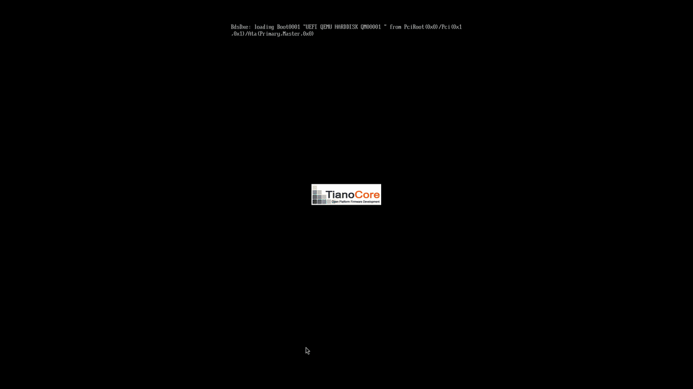
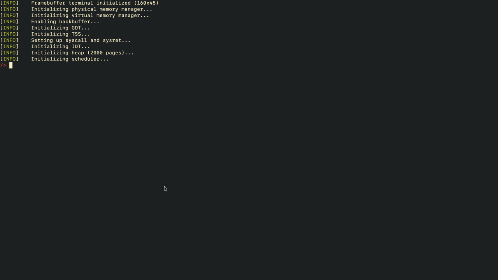
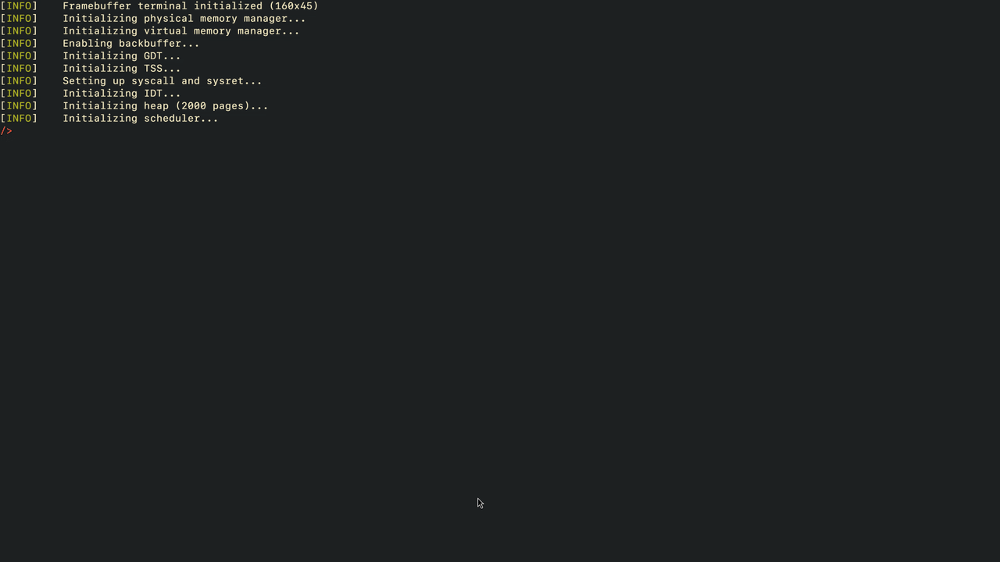

# Operating system kernel

A kernel for a minimal UNIX-like operating system, developed for my bachelor's degree at the [Faculty of Mathematics and Computer Science, University of Bucharest](https://www.fmi.unibuc.ro/) for the x86-64 architecture.
The project also includes a minimal userspace environment, making it a complete, self-contained operating system.

Full thesis documentation is available [here](docs/thesis.pdf).

## Features

### Kernel
- Monolithic kernel design
- UEFI boot using the Limine bootloader
- x86-64 architecture, single-core (no SMP)
- Preemptive multitasking (supporting both user processes and kernel threads)
- Userspace/kernel memory separation
- Paging-based virtual memory
- Linux-inspired system call interface
- ELF loader for userspace programs
- Virtual filesystem (VFS) abstraction
- Read-only ext2 filesystem support
- Basic framebuffer-based terminal (with minimal ANSI escape code support)

### Userspace / Demo

- Minimal userspace environment with C wrappers for system calls
- Minimal coreutils-style utilities: `cat`, `echo`, `ls`, `grep`, etc.
- Demo programs:
  - Simple shell
  - Text editor (based on [a previous project](https://github.com/0xfabian/ed))
  - CPU-based graphics demos, including a path tracer and a rasterizer
- Compatible enough with Linux binaries to support static compilation of [TCC (Tiny C Compiler)](https://bellard.org/tcc/)
- Designed to be easily extended for additional userspace programs and libraries


## Screenshots

<div align="center">
  
  
  
  
  
</div>

## Repo structure

```bash
.
├── boot/
│   ├── esp/            # EFI System Partition files for booting
│   └── makefile        # Builds the boot image and copies the kernel.elf
│
├── docs/
│   ├── screenshots/
│   └── thesis.pdf      # Bachelor’s degree documentation
│
├── kernel/
│   ├── include/        # Kernel headers
│   ├── src/            # Kernel source files (C++/ASM)
│   ├── link.ld         # Linker script for kernel
│   └── makefile        # Builds the kernel.elf
│
├── ovmf/               # UEFI firmware files (not included in repo; see Build/Run section)
│   ├── OVMF_CODE.fd
│   └── OVMF_VARS.fd
│
├── scripts/
│   └── init_disk.sh    # Creates an ext2 formatted disk image
│
├── user/
│   ├── include/        # User headers
│   ├── src/            # Source of various binaries
│   └── makefile        # Builds the binaries and libraries
│
├── LICENSE             # BSD 2-Clause License
├── makefile            # Top level makefile, also runs the OS in QEMU
└── README.md
```

## Dependencies

This project expects a typical Linux development environment with a standard toolchain:

- Standard toolchain: `gcc`, `g++`, `ld`, `make`
- `nasm` — for assembling kernel and userspace assembly code
- `sgdisk`, `mtools`, `mkfs.ext2` — for creating and populating disk images (needed if building userspace)

If you want to run with QEMU you also need:

- `qemu-system-x86_64`
- UEFI firmware files: `OVMF_CODE.fd` and `OVMF_VARS.fd` (see next section for more details)

## Build / Run

To build a bootable image, run the following from the project root:

```sh
make
```

The resulting image will be located at `boot/image.hdd`.

### Running with QEMU

To run the OS in QEMU, you need the UEFI firmware files (`OVMF_CODE.fd` and `OVMF_VARS.fd`). These can be:

- Installed via your package manager (e.g., `apt install ovmf` on Debian/Ubuntu), or
- Downloaded from [TianoCore OVMF](https://github.com/tianocore/edk2).

On Linux systems, these files are usually installed under `/usr/share/OVMF/` (sometimes with slightly different names, e.g., `OVMF_CODE_4M.fd` and `OVMF_VARS_4M.fd`).

Once obtained, place the files in the `ovmf/` folder for a clean setup:

```text
ovmf/
├── OVMF_CODE.fd
└── OVMF_VARS.fd
```

Then run:

```sh
make run
```

This will launch the kernel with the minimal built-in userspace utilities.

### Development / Userspace

For a more complete environment with userspace programs:

```sh
sh scripts/init_disk.sh   # Creates and mounts an ext2 disk image at disk/
make user                 # Builds all userspace binaries and libraries
cp -r user/* disk/        # Copies userspace files into the disk image
make run                  # Run the OS with the userspace available at /mnt
```

> [!NOTE]
> `make clean` does **not** remove `disk.img`. If you want to remove the disk image, just unmount it and delete the file:
>
> ```sh
> sudo umount disk
> rm disk.img
> ```

## License

This project is licensed under the 2-clause BSD license. See the [LICENSE](LICENSE) file for details.
